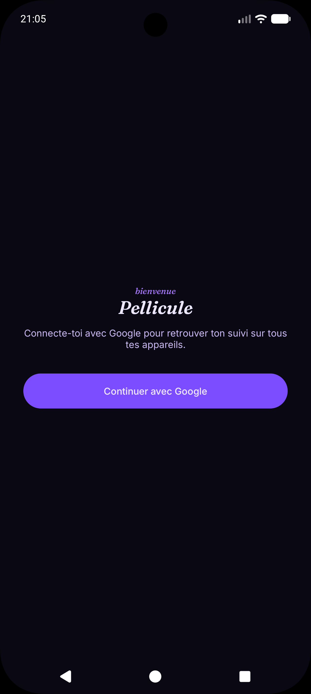
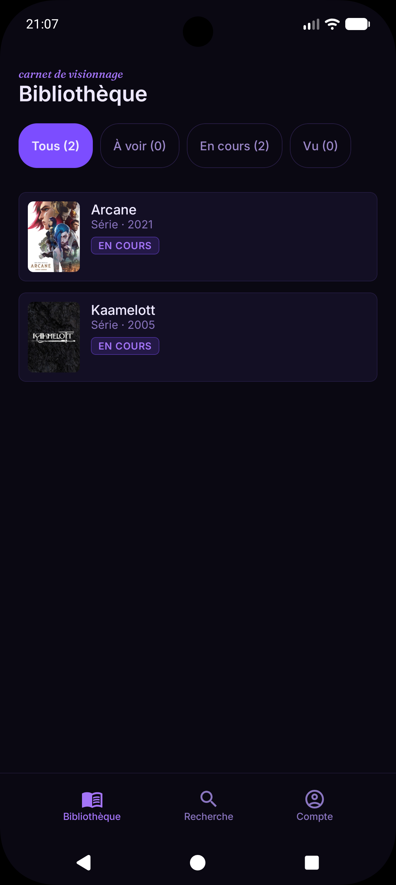
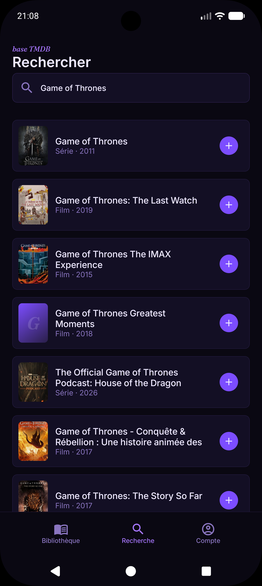
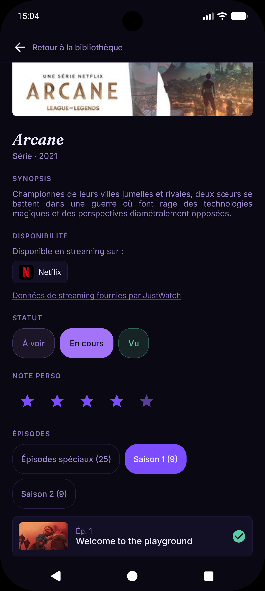
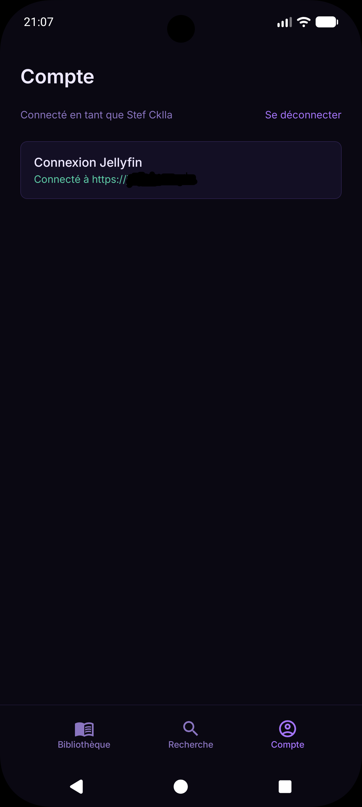

# Pellicule

Application Android personnelle de suivi de films, séries et anime : suivez ce qui est à voir, en
cours ou vu, recherchez de nouveaux contenus via l'API TMDB, et retrouvez votre suivi synchronisé
automatiquement entre tous vos appareils grâce à Firebase. Synchronisation bidirectionnelle
optionnelle avec un serveur Jellyfin.

<!-- Bannière/logo optionnel :

-->

## Sommaire

- [Fonctionnalités](#fonctionnalités)
- [Captures d'écran](#captures-décran)
- [Stack technique](#stack-technique)
- [Architecture](#architecture)
- [Installation](#installation)
- [Configuration des règles Firestore](#configuration-des-règles-firestore)
- [Synchronisation Jellyfin](#synchronisation-jellyfin)
- [Sécurité](#sécurité)
- [Build de release signé](#build-de-release-signé)
- [Tests](#tests)
- [Structure du projet](#structure-du-projet)
- [Choix techniques notables](#choix-techniques-notables)
- [Confidentialité](#confidentialité)
- [Licence](#licence)

## Fonctionnalités

- **Bibliothèque** : liste du suivi avec statut visuel (À voir / En cours / Vu), films, séries et
  anime confondus.
- **Recherche** : recherche multi-type via l'[API TMDB](https://www.themoviedb.org/documentation/api)
  (titre, affiche, année), aperçu de la fiche avant ajout, ajout en un tap au suivi. Fiches en
  français en priorité, avec fallback sur l'anglais quand la traduction française manque.
- **Fiche détail** : changement de statut, note personnelle (1 à 5 étoiles), synopsis TMDB, retrait
  du suivi. Pour les séries et anime, liste des épisodes par saison avec statut vu/non-vu
  individuel.
- **Suivi par épisode** : statut vu/non-vu géré à la main par défaut, ou synchronisé automatiquement
  avec Jellyfin si un serveur est connecté (voir plus bas). Le statut global d'une série/anime se
  synchronise alors automatiquement une fois Jellyfin actif.
- **Connexion Google** : authentification obligatoire (Firebase Auth) pour identifier l'utilisateur
  et sécuriser ses données côté cloud.
- **Synchronisation multi-appareils** : le suivi est mirroré en continu entre l'appareil (Room) et
  Firebase Firestore. Un suivi local déjà existant est automatiquement uploadé lors de la toute
  première connexion. L'application reste utilisable hors-ligne : Room fait toujours foi pour
  l'affichage, Firestore synchronise en arrière-plan dès que le réseau est disponible.
- **Synchronisation Jellyfin (optionnelle)** : l'app est pleinement utilisable sans serveur Jellyfin
  — c'est un module qu'on active en renseignant un serveur dans l'écran Compte. Une fois connecté,
  le statut vu (films et épisodes) se synchronise dans les deux sens entre Pellicule et
  Jellyfin.

## Captures d'écran

| Connexion | Bibliothèque | Recherche |
|:---:|:---:|:---:|
|  |  |  |

| Détail | Compte |
|:---:|:---:|
|  |  |

## Stack technique

| Domaine | Choix |
|---|---|
| Langage | Kotlin 2.2 |
| UI | Jetpack Compose (BOM 2026.02.01) |
| Navigation | Navigation Compose |
| Persistance locale | Room 2.8 |
| Réseau | Retrofit 3 + Moshi (TMDB, Jellyfin) |
| Injection de dépendances | Hilt |
| Cloud | Firebase Firestore (données) + Firebase Auth (Google Sign-In) |
| Chargement d'images | Coil |
| Tests | JUnit4 + kotlinx-coroutines-test, tests unitaires basés sur des fakes (pas de mock ni Robolectric) |

## Architecture

Architecture **MVVM**, avec le Repository comme unique source de vérité orchestrant Room, Firebase
et Jellyfin :

```
UI (Compose)
   ↕ StateFlow / UiState
ViewModel
   ↕
Repository (source de vérité unique)
   ↙                    ↓                    ↘
Room (cache local,   Firebase Firestore/Auth   Retrofit/Moshi
offline)             (sync distante)           (recherche TMDB,
                                                 synchro Jellyfin optionnelle)
```

- Les ViewModels n'accèdent jamais directement à Retrofit, Room ou Firebase — toujours via une
  interface de repository (`domain/repository/`), injectée par Hilt.
- **Room** reste la seule source lue par l'UI (`observeMedia()`), même en ligne : ça garantit un
  affichage instantané et un fonctionnement hors-ligne complet.
- **Firestore** fait autorité sur le contenu du suivi dès qu'un compte est connecté : il est écouté
  en temps réel et mirroré dans Room (ajouts/suppressions distants répercutés localement). Les
  écritures locales (ajout/modification/suppression) sont appliquées à Room en premier, puis
  répercutées vers Firestore en best-effort (un échec réseau n'empêche jamais l'écriture locale ;
  le SDK Firestore gère lui-même la persistance et la synchronisation différée hors-ligne).
- **Bootstrap** : à la toute première connexion d'un utilisateur dont la collection Firestore est
  vide, le suivi local existant est uploadé automatiquement.
- **Jellyfin, module indépendant** : aucune des fonctionnalités de base (suivi manuel, recherche,
  synchro cloud) ne dépend de Jellyfin. Quand un serveur est connecté, le pull (Jellyfin → Pellicule)
  se déclenche à chaque reprise de l'app et ne peut qu'ajouter du vu (jamais en retirer) ; le push
  (Pellicule → Jellyfin) est best-effort et se déclenche à chaque changement local.
- Erreurs réseau/Firebase remontées du Repository sous forme d'erreurs structurées
  (`Resource.Success` / `Resource.Error`), traduites en message utilisateur côté UI.

## Installation

### Prérequis

- Android Studio (dernière version stable) avec JDK 17+.
- Un appareil ou émulateur Android en API 24 (Android 7.0) ou supérieur.
- Une clé API [TMDB](https://www.themoviedb.org/settings/api) (gratuite).
- Un projet [Firebase](https://console.firebase.google.com/) avec Firestore et l'authentification
  Google Sign-In activés.
- Optionnel : un serveur [Jellyfin](https://jellyfin.org/) accessible depuis l'appareil, pour la
  synchronisation du statut vu.

### 1. Cloner le projet

```bash
git clone https://github.com/Cklla/Pellicule
cd Pellicule
```

### 2. Configurer la clé API

Créer un fichier `local.properties` à la racine du projet (ignoré par git) avec :

```properties
sdk.dir=/chemin/vers/le/sdk/android

TMDB_API_KEY=votre_clé_tmdb
```

### 3. Configurer Firebase

1. Dans la [console Firebase](https://console.firebase.google.com/), créer un projet et y ajouter
   une application Android avec le package `fr.cklla.pellicule`.
2. Activer **Firestore Database** et le fournisseur **Google** dans **Authentication**.
3. Renseigner l'empreinte SHA-1 du keystore de debug (`./gradlew signingReport`) dans les
   paramètres de l'application Android sur la console Firebase — requis par Google Sign-In. Faire
   de même avec le SHA-1 du keystore de release avant de distribuer un build signé (voir
   [Build de release signé](#build-de-release-signé)).
4. Télécharger le fichier `google-services.json` généré et le placer dans `app/` (ignoré par git).
5. Activer **App Check** (onglet dédié de la console Firebase), enregistrer l'app avec le
   fournisseur **Play Integrity**. Au premier lancement en debug, un jeton s'affiche dans logcat :
   à déclarer dans App Check → l'app Android → menu **⋮** → *Gérer les jetons de débogage*, sans
   quoi les builds de debug seront rejetés dès qu'App Check passera en mode appliqué.

### 4. Compiler et lancer

```bash
./gradlew assembleDebug
```

ou directement depuis Android Studio (Run ▶). La connexion à Jellyfin n'est pas requise pour
utiliser l'application : elle reste optionnelle et s'active depuis l'écran Compte.

## Configuration des règles Firestore

Les règles de sécurité (`firestore.rules`, versionnées dans ce dépôt) restreignent chaque
utilisateur à ses propres données et valident la forme de chaque document écrit (champs autorisés,
types, bornes numériques) — voir le fichier pour le détail, il fait foi.

À publier depuis l'onglet **Firestore Database → Règles** de la console Firebase (copier/coller le
contenu du fichier, puis **Publier**).

## Synchronisation Jellyfin

Entièrement optionnelle — l'app fonctionne sans serveur Jellyfin, le suivi restant alors géré à la
main. Pour l'activer :

1. Depuis l'écran **Compte**, renseigner l'URL du serveur, un nom d'utilisateur et un mot de passe
   Jellyfin (authentification par login utilisateur, pas de clé API admin nécessaire).
2. Aucun plugin serveur requis : authentification, lecture et écriture du statut vu passent par des
   routes core de l'API Jellyfin (`AuthenticateByName`, `UserData`, `PlayedItems`).
3. Le mapping entre un contenu Pellicule et son équivalent Jellyfin se fait via l'identifiant TMDB
   (`ProviderIds.Tmdb`) — fiable dès lors que la bibliothèque Jellyfin est indexée par TheMovieDb.

Le mot de passe n'est jamais stocké : seule la session (URL, identifiant utilisateur, jeton d'accès)
est conservée, chiffrée sur l'appareil (`androidx.security:security-crypto`).

## Sécurité

- **Règles Firestore** : accès restreint à `users/{uid}/...` où `uid` est celui de l'utilisateur
  authentifié, et validation stricte des documents écrits (voir ci-dessus).
- **Firebase App Check** : chaque appel à Firestore/Auth est accompagné d'un jeton attestant que la
  requête vient bien de cette app installée sur un appareil légitime (fournisseur **Play Integrity**
  en release, fournisseur de debug en développement) — empêche l'utilisation du projet Firebase
  depuis un script ou une app reconstruite à partir du binaire.
- **`allowBackup="false"`** : aucune donnée locale (base Room, session Jellyfin, session Firebase)
  ne part dans une sauvegarde Google Drive ni un transfert d'appareil.
- **Session Jellyfin chiffrée** (`EncryptedSharedPreferences`) : c'est un jeton d'accès à un compte
  réel sur un serveur média personnel, traité différemment d'une clé API de build.
- **R8 + shrinking des ressources en release** : code réduit et obfusqué, ressources inutilisées
  retirées.
- **Affiches en HTTPS uniquement** : toute URL d'image reçue d'une API externe est vérifiée avant
  affichage.

## Build de release signé

```bash
./gradlew bundleRelease
```

Nécessite un `keystore.properties` à la racine du projet (ignoré par git), chargé par
`app/build.gradle.kts` uniquement s'il existe — un `assembleDebug` ou un build CI sans ce fichier
continue de fonctionner sans configuration de signature :

```properties
storeFile=/chemin/absolu/vers/le/keystore.jks
storePassword=...
keyAlias=...
keyPassword=...
```

Générer le keystore avec `keytool` (sans `-storepass`/`-keypass` pour être invité de façon
interactive plutôt que de laisser les mots de passe traîner dans l'historique du shell) :

```bash
keytool -genkeypair -v -storetype JKS -keystore /chemin/vers/pellicule-release.jks \
  -alias pellicule -keyalg RSA -keysize 2048 -validity 10000
```

Conserver ce fichier précieusement : sa perte rend impossible toute mise à jour future d'une
version déjà publiée.

## Tests

```bash
./gradlew testDebugUnitTest
```

Les tests unitaires couvrent les ViewModels et les Repository (logique de synchro Firestore ↔ Room,
mapping Firestore, synchro Jellyfin, gestion d'erreurs) via des implémentations *fake* des
dépendances (pas de mocking ni de Robolectric), pour des tests rapides et déterministes.

## Structure du projet

```
app/src/main/java/fr/cklla/pellicule/
├── data/
│   ├── local/          # Room : entités, DAO, base de données, session Jellyfin chiffrée
│   ├── remote/
│   │   ├── dto/        # Réponses API TMDB
│   │   ├── firestore/  # Source de données Firestore + mapping
│   │   └── jellyfin/   # Client Jellyfin (auth, statut vu, DTO)
│   └── repository/     # Implémentations concrètes des repositories
├── di/                  # Modules Hilt
├── domain/
│   ├── model/           # Modèles métier (Media, WatchStatus, Resource, AuthUser…)
│   └── repository/      # Interfaces de repository
└── ui/
    ├── bibliotheque/    # Écran Bibliothèque
    ├── detail/          # Écran Détail d'un contenu (statut, épisodes, note)
    ├── login/           # Écran de connexion Google
    ├── recherche/       # Écran Recherche TMDB
    ├── compte/          # Écran Compte (déconnexion, connexion Jellyfin)
    ├── jellyfin/         # Écran de connexion à un serveur Jellyfin
    ├── sync/              # Synchro Jellyfin déclenchée à la reprise de l'app
    ├── navigation/         # Routes Navigation Compose
    └── theme/              # Thème Compose (couleurs, typographie)
```

## Choix techniques notables

- **TMDB comme fournisseur de métadonnées unique** : gratuit, couvre films/séries/anime, et c'est le
  fournisseur par défaut de Jellyfin — ce qui rend le mapping d'identifiants entre l'app et un
  serveur Jellyfin direct dans la majorité des cas.
- **UUID plutôt qu'identifiant auto-incrémenté** pour `Media.id` : le même identifiant désigne le
  même contenu sur Room et sur Firestore, sans table de correspondance séparée.
- **Room comme unique source lue par l'UI**, même en ligne : garantit un affichage instantané et un
  fonctionnement hors-ligne complet, Firestore et Jellyfin ne faisant que mirrorer en arrière-plan.
- **Connexion Google obligatoire** dès le lancement : simplifie les règles de sécurité Firestore
  (un utilisateur = un espace de données) sans avoir à gérer de mot de passe dédié — indépendant de
  la connexion Jellyfin, qui reste elle entièrement optionnelle.
- **La synchro Jellyfin ne peut que faire progresser le suivi** : le pull ajoute les épisodes vus du
  serveur sans jamais dévoir ce qui l'est déjà localement, ni faire régresser un statut — un serveur
  réinstallé sans son historique ne peut pas effacer le suivi. Les retours en arrière se font depuis
  l'app, qui démarque alors aussi côté Jellyfin.

## Confidentialité

Voir [PRIVACY.md](PRIVACY.md) pour le détail des données traitées (compte Google, suivi,
connexion Jellyfin optionnelle) et de leur usage.

## Licence

Projet personnel — usage privé.
