# Pellicule

Application Android personnelle de suivi de films, séries et anime : ce qui est à voir, en cours ou
vu, avec recherche via l'API TMDB et synchronisation entre appareils grâce à Firebase.
Synchronisation bidirectionnelle optionnelle avec un serveur Jellyfin.

## Fonctionnalités

- **Bibliothèque** : suivi des films, séries et anime par statut (À voir / En cours / Vu), filtrable
  par type et par année de visionnage.
- **Recherche** : recherche TMDB multi-type, aperçu de la fiche avant ajout. Fiches en français, avec
  repli sur l'anglais quand la traduction manque.
- **Fiche détail** : statut, note de 1 à 5 étoiles, synopsis, et pour les séries et anime, épisodes
  vus / non vus par saison.
- **Prochain épisode et « +1 »** : l'épisode suivant s'affiche sur la carte, un tap le marque vu.
- **Calendrier de diffusion et rappels** : prochaine sortie d'une série en cours, avec notification
  locale optionnelle le jour de l'épisode.
- **Statistiques** : contenus vus par type et par année, en anneau.
- **Année de visionnage** : modifiable à la main depuis la fiche d'un contenu Vu.
- **Récap annuel** : bilan de l'année du 25 décembre au 31 janvier, avec notification locale.
- **Récap en images** : suite de slides façon *Wrapped* (total, coups de cœur par type, faits de
  l'année, mosaïque des affiches).
- **Compte et synchronisation** : connexion Google, suivi synchronisé entre appareils via Firestore,
  utilisable hors ligne.
- **Jellyfin (optionnel)** : le statut vu se synchronise dans les deux sens avec un serveur. Sans
  serveur, tout reste géré à la main.

## Captures d'écran

| Connexion | Bibliothèque | Recherche | Détail |
|:---:|:---:|:---:|:---:|
| 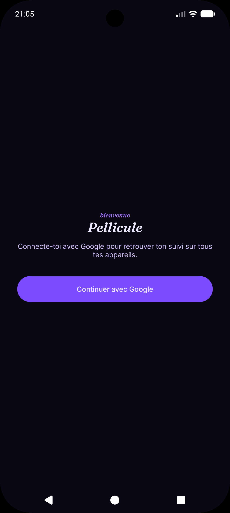 | 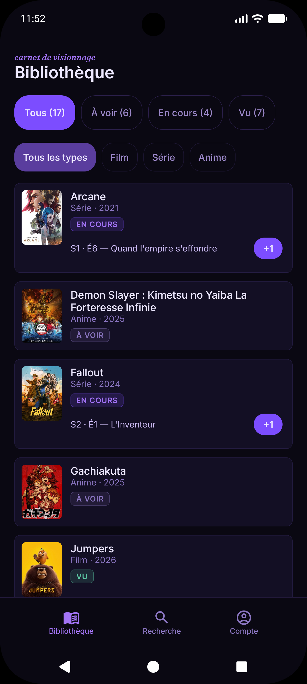 | 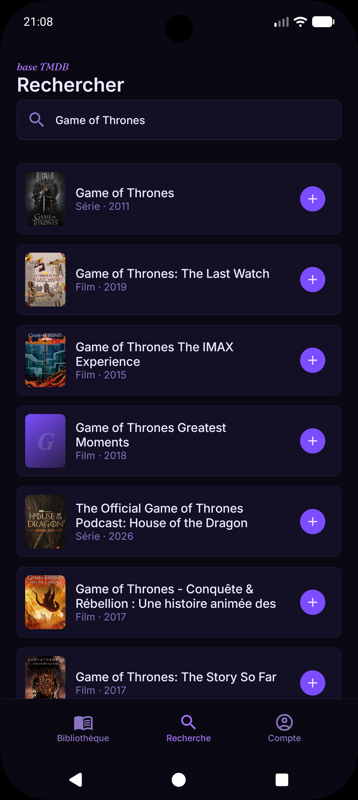 | 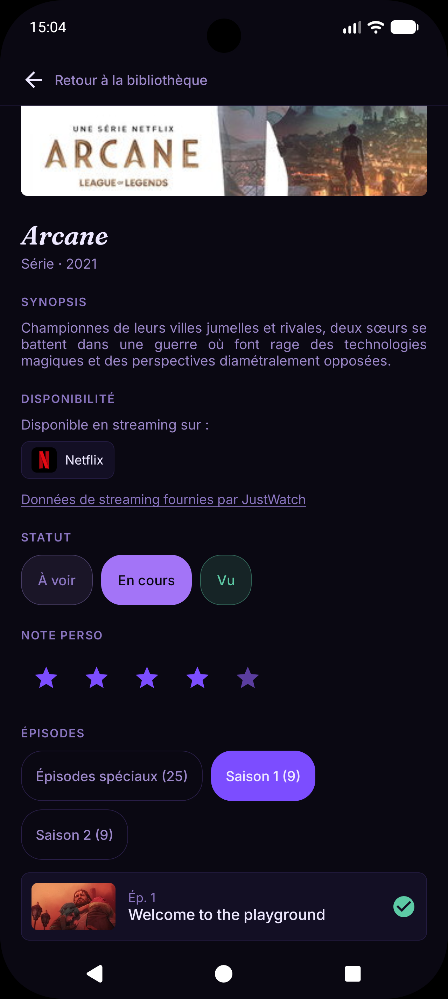 |

| Compte | Statistiques | Récap annuel | Calendrier |
|:---:|:---:|:---:|:---:|
| 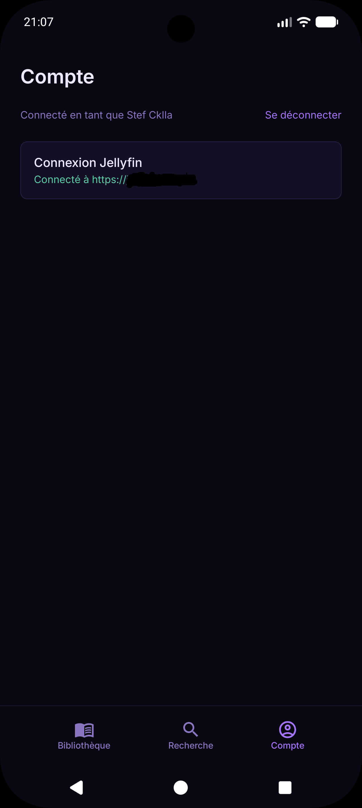 | 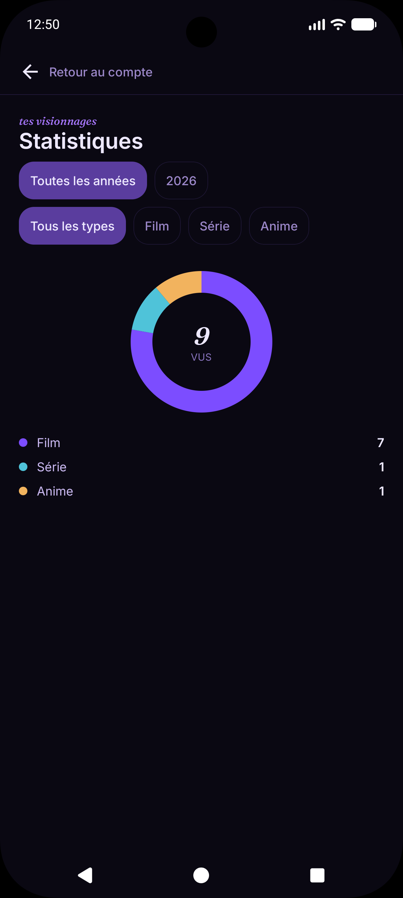 | 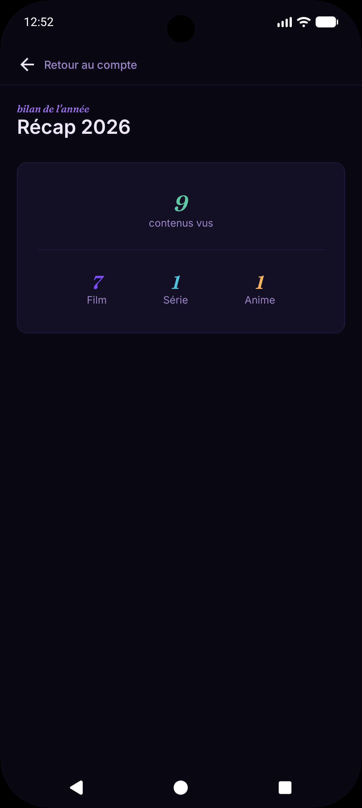 | 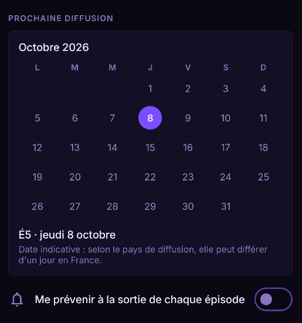 |

| Récap en images | Faits de l'année | Mosaïque |
|:---:|:---:|:---:|
| 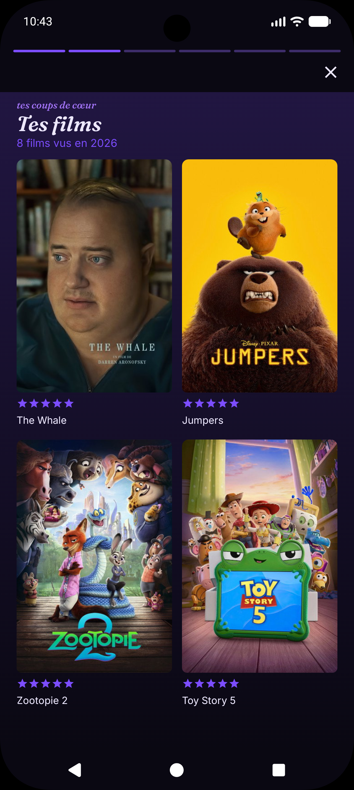 | 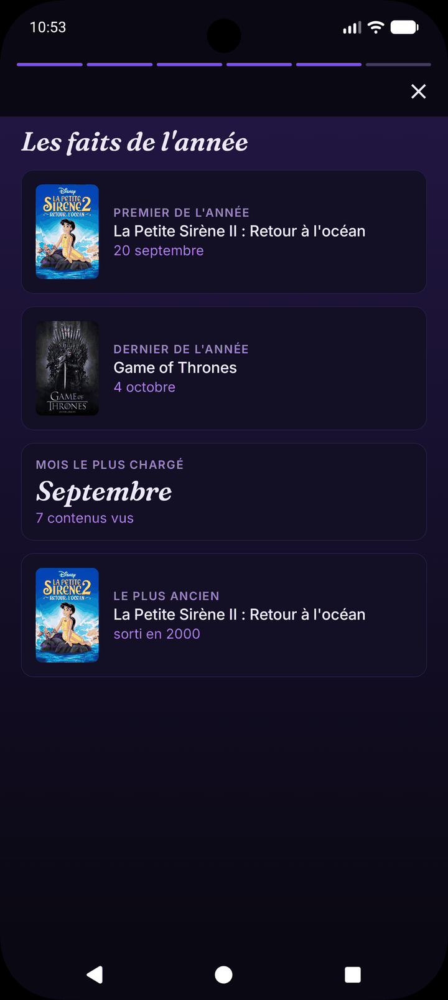 | 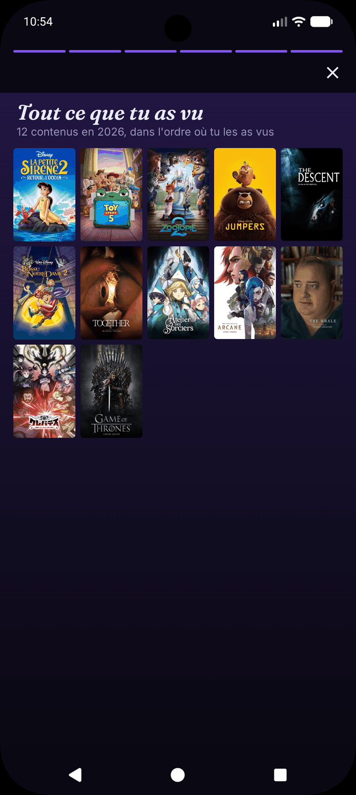 |

## Stack technique

| Domaine | Choix |
|---|---|
| Langage / UI | Kotlin 2.2, Jetpack Compose, Navigation Compose |
| Persistance locale | Room |
| Réseau | Retrofit + Moshi (TMDB, Jellyfin) |
| Injection de dépendances | Hilt |
| Arrière-plan | WorkManager (rappels d'épisodes, notification du récap) |
| Cloud | Firebase Firestore + Auth (Google Sign-In) |
| Images | Coil |
| Tests | JUnit4 + kotlinx-coroutines-test, avec des fakes (ni mock ni Robolectric) |

## Architecture

MVVM, avec le Repository comme source de vérité unique :

```
UI (Compose) ↔ ViewModel ↔ Repository ─┬─ Room (cache local, hors ligne)
                                       ├─ Firestore / Auth (synchro distante)
                                       └─ Retrofit (TMDB, Jellyfin optionnel)
```

- Les ViewModels passent toujours par une interface de repository (`domain/repository/`), injectée
  par Hilt.
- **Room est la seule source lue par l'UI**, même en ligne : affichage instantané et usage hors
  ligne complet.
- Les écritures vont d'abord dans Room, puis vers Firestore en best-effort ; Firestore fait autorité
  sur le contenu dès qu'un compte est connecté et est mirroré dans Room.
- Jellyfin est un module indépendant : rien du suivi de base n'en dépend.

## Installation

**Prérequis** : Android Studio avec JDK 17+, un appareil ou émulateur en API 24 ou plus, une clé API
[TMDB](https://www.themoviedb.org/settings/api), un projet [Firebase](https://console.firebase.google.com/)
avec Firestore et Google Sign-In activés. Un serveur [Jellyfin](https://jellyfin.org/) est optionnel.

1. **Cloner** : `git clone https://github.com/Cklla/Pellicule`
2. **Clé TMDB** : dans `local.properties` (ignoré par git) :
   ```properties
   sdk.dir=/chemin/vers/le/sdk/android
   TMDB_API_KEY=votre_clé_tmdb
   ```
3. **Firebase** : créer une application Android `fr.cklla.pellicule`, activer Firestore et le
   fournisseur Google d'Authentication, déclarer le SHA-1 du keystore de debug
   (`./gradlew signingReport`), puis placer `google-services.json` dans `app/` (ignoré par git).
4. **App Check** : enregistrer l'app avec **Play Integrity**. En debug, le jeton affiché dans logcat
   se déclare dans *App Check → l'app → ⋮ → Gérer les jetons de débogage*.
5. **Règles Firestore** : copier `firestore.rules` dans *Firestore Database → Règles* et publier.
   Chaque utilisateur n'accède qu'à ses données, et la forme de chaque document est validée.
6. **Lancer** : `./gradlew assembleDebug`, ou Run ▶ dans Android Studio.

## Synchronisation Jellyfin

Optionnelle, activée depuis l'écran **Compte** avec l'URL du serveur et un identifiant Jellyfin
(pas de clé API admin ni de plugin). Authentification et statut vu passent par des routes core de
l'API ; un contenu est relié à son équivalent Jellyfin par son identifiant TMDB. Le mot de passe
n'est jamais stocké : seule la session est conservée, chiffrée sur l'appareil. Le pull depuis
Jellyfin ne peut qu'ajouter du vu, jamais en retirer.

## Tests

```bash
./gradlew testDebugUnitTest
```

Les tests couvrent les ViewModels, les repositories (synchro Firestore ↔ Room, Jellyfin, erreurs) et
la logique pure (récap, calendrier, filtres), avec des fakes pour rester rapides et déterministes.

## Structure du projet

```
app/src/main/java/fr/cklla/pellicule/
├── data/           # Room, clients distants (TMDB, Firestore, Jellyfin), repositories
├── di/             # Modules Hilt
├── domain/         # Modèles, interfaces de repository, cas d'usage, logique pure
├── notification/   # Canaux, Workers et notifications locales
└── ui/             # Écrans Compose, navigation, thème
```

## Choix techniques notables

- **TMDB comme unique fournisseur de métadonnées** : gratuit, couvre films, séries et anime, et c'est
  le fournisseur par défaut de Jellyfin, ce qui rend le mapping d'identifiants direct.
- **UUID pour `Media.id`** : le même identifiant côté Room et Firestore, sans table de correspondance.
- **Notifications locales, sans FCM** : un job WorkManager quotidien décide d'après la date de
  l'appareil ; rien n'est synchronisé.
- **Année de visionnage choisie stockée au 1er juillet à midi** : relue à l'identique quel que soit le
  fuseau, sans champ ni migration (c'est le `watchedAt` existant).
- **Statistiques et récaps calculés en direct** à partir de données déjà stockées, par des fonctions
  pures : aucune donnée supplémentaire à synchroniser.

## Confidentialité

Voir [PRIVACY.md](PRIVACY.md).

## Licence

Projet personnel — usage privé.
